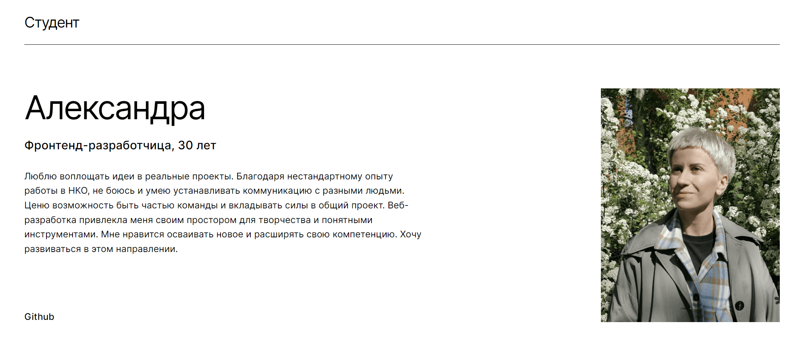
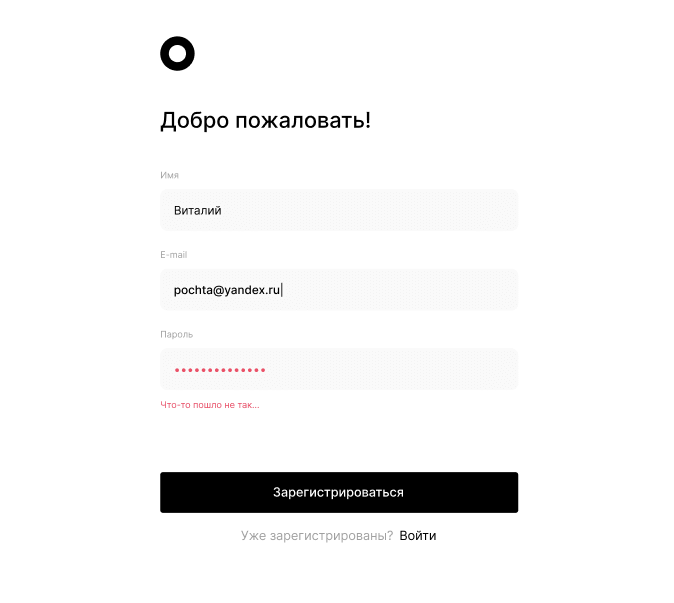
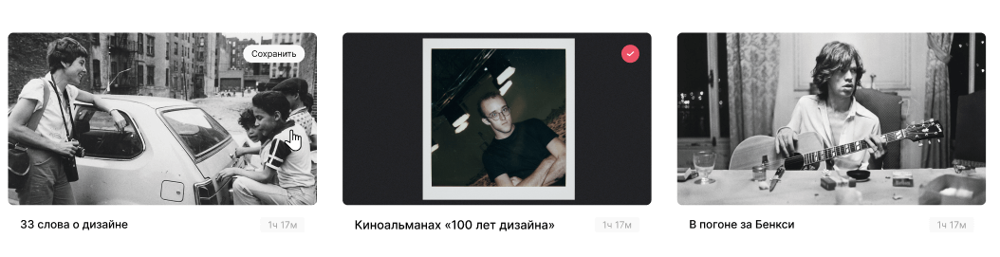
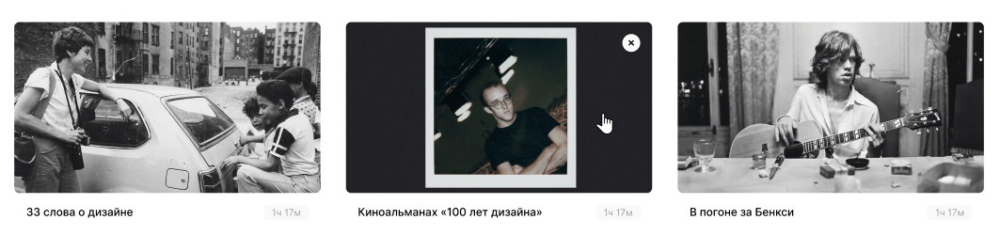
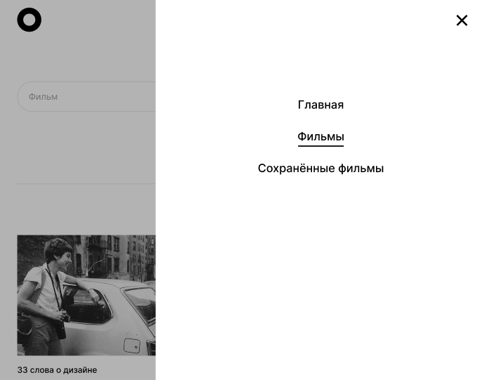

# __Проект: Movies Explorer__

*Репозиторий фронтенда дипломной работа на курсе по веб-разработке от [Яндекс-практикума](https://practicum.yandex.ru/ "Перейти на сайт практикума")*

## Обзор

Проект интерактивного сервиса для любителей кино, выполненный на основе [макета](https://www.figma.com/file/6FMWkB94wE7KTkcCgUXtnC/%D0%94%D0%B8%D0%BF%D0%BB%D0%BE%D0%BC%D0%BD%D1%8B%D0%B9-%D0%BF%D1%80%D0%BE%D0%B5%D0%BA%D1%82?type=design&node-id=1%3A2798&mode=design&t=frnuhMvh0xXEee0V-1 "Посмотреть макет") в Figma. 

Главная страница сайта содержит информацию о проекте. А также блок обо мне:

Реализована возможность регистрации. Все поля формы регистрации и авторизации валидируются:

Для авторизованных пользователей доступны следующие страницы:  
- редактирование профиля
- страница для поиска фильмов

- страница сохраненных карточек с фильмами

На маршрутах movies и saved-movies есть форма с чекбоксом для поиска и фильтрации фильмов:

Благодаря использованию технологий Grid Layout, flexbox, а также применению медиазапросов, сайт корректно подстраивается под любое разрешение. Реализовано бургер-меню:

## Стек технологий

* HTML
* CSS
* JavaScript
* React

## Связанные репозитории

Бэкенд-часть проекта: (https://github.com/sashakostiukova/movies-explorer-api)

## __Связаться со мной__
sashakostiukova@yandex.ru